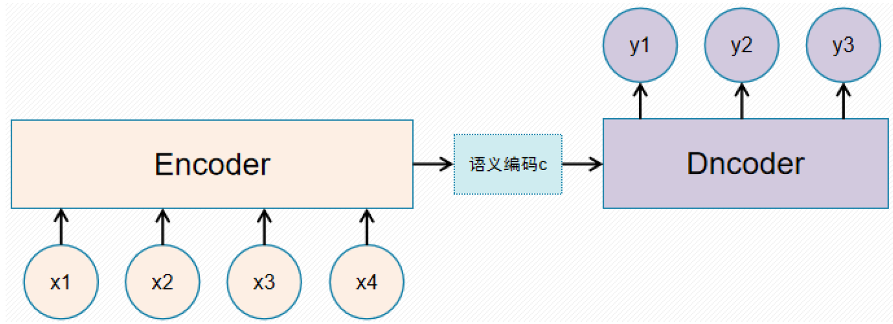
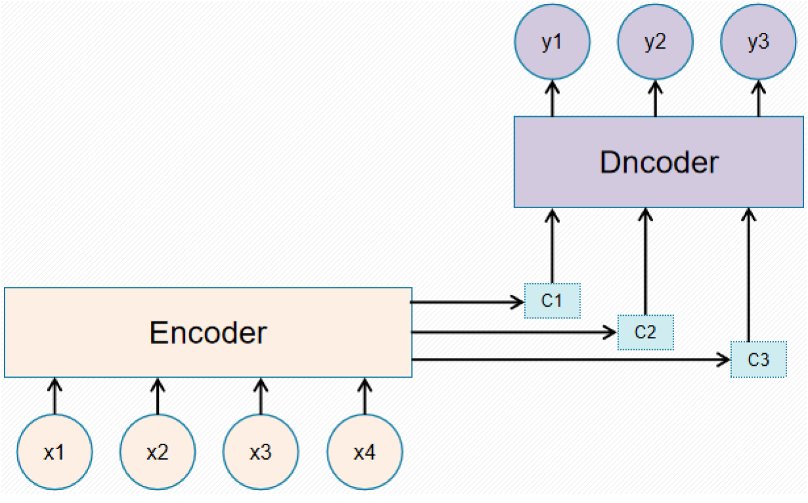
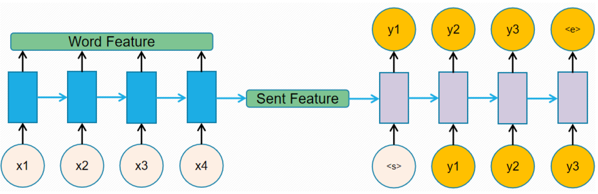
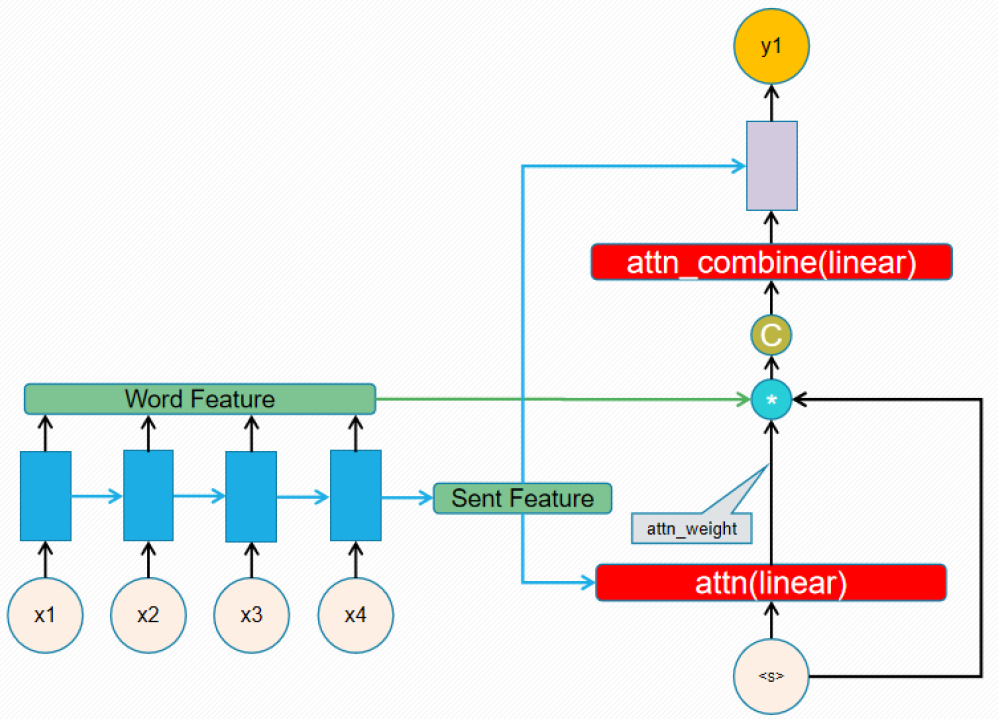
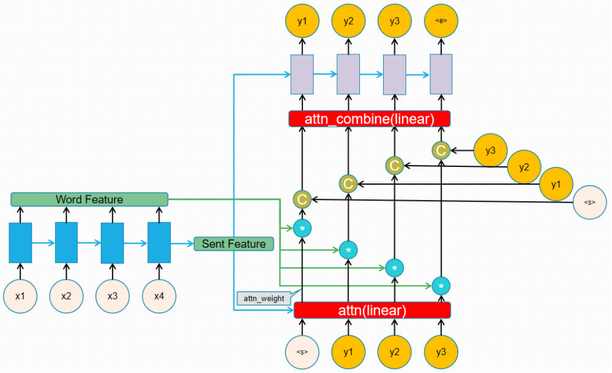

> 关于在 Attention 机制在 Image Caption 的 Decoder 部分的原理及代码笔记。

# Attention 知识笔记 

资料：

- [Attention Model(mechanism) 的套路](https://blog.csdn.net/bvl10101111/article/details/78470716)
- [Attention Model详解](https://www.cnblogs.com/Libo-Master/p/7884958.html)
- [practical-pytorch](https://github.com/spro/practical-pytorch)
- [Attention 机制](https://xueqiu.com/3426965578/88317304)

## The Sequence to Sequence model 

A [Sequence to Sequence](https://arxiv.org/abs/1409.3215) network, or seq2seq network, or [Encoder Decoder network](https://arxiv.org/pdf/1406.1078v3.pdf), is a model consisting of two separate RNNs called the encoder and decoder. The encoder reads an input sequence one item at a time, and outputs a vector at each step. The final output of the encoder is kept as the context vector. The decoder uses this context vector to produce a sequence of outputs one step at a time. Image captioning tasks take an image as input, and output a description of the image (img2seq). Some image generation tasks take a description as input and output a generated image (seq2img). These models can be referred to more generally as "encoder decoder" networks.

现在的 Seq2Seq 或者 Encoder-Decoder 是最基本的模型，这种结构的模型通常将输入序列编码成一个固定长度的向量表示，对于长度较短的输入序列而言，该模型能够学习出对应合理的向量表示。然而，这种模型存在的问题在于：输入序列不论长短都会被编码成一个固定长度的向量表示，而解码则受限于该固定长度的向量表示，当输入序列非常长时，模型难以保留全部的必要信息，也即难以学到合理的向量表示。



## Attention Mechanism

The attention mechanism introduced by [Bahdanau et al.](https://arxiv.org/abs/1409.0473) addresses this by giving the decoder a way to "pay attention" to parts of the input, rather than relying on a single vector. For every step the decoder can select a different part of the input sentence to consider.   

Attention机制的基本思想是，打破了传统编码器-解码器结构在编解码时都依赖于内部一个固定长度向量的限制。  
Attention机制的实现是通过保留LSTM编码器对输入序列的中间输出结果，然后训练一个模型来对这些输入进行选择性的学习并且在模型输出时将输出序列与之进行关联。

换一个角度而言，输出序列中的每一项的生成概率取决于在输入序列中选择了哪些项。
使用 Attention 机制便于理解在模型输出过程中输入序列中的信息是如何影响最后生成序列的。这有助于我们更好地理解模型的内部运作机制以及对一些特定的输入-输出进行 debug。



## Code

From [TRANSLATION WITH A SEQUENCE TO SEQUENCE NETWORK AND ATTENTION](https://pytorch.org/tutorials/intermediate/seq2seq_translation_tutorial.html?highlight=attention)

```python
import torch
import torch.nn as nn
import torch.nn.functional as F
```

**Fake Input Data** 

- input_tensor: 假设输入的句子为5个单词，编码对应词典id
- target_tensor: 假设输出的句子为6个单词，编码对应词典id
- MAX_LENGTH： Encoder的最大句子长度为10个单词，少则 补0， 多则删除。

```python
MAX_LENGTH = 10

input_tensor = torch.rand((5, 1)).long()
target_tensor = torch.rand((6, 1)).long()

input_length = input_tensor.shape[0]
target_length = target_tensor.shape[0]
```

**Encoder** 

```python
class EncoderRNN(nn.Module):
    def __init__(self, input_size, hidden_size):
        super(EncoderRNN, self).__init__()
        self.hidden_size = hidden_size

        self.embedding = nn.Embedding(input_size, hidden_size)
        self.gru = nn.GRU(hidden_size, hidden_size)

    def forward(self, input_, hidden):
        embedded = self.embedding(input_).view(1, 1, -1)
        output = embedded
        output, hidden = self.gru(output, hidden)
        return output, hidden

    def initHidden(self):
        return torch.zeros(1, 1, self.hidden_size)
```

```python
in_num_of_words = 5000  # 输入词典的大小
hidden_size = 256
encoder = EncoderRNN(in_num_of_words, hidden_size)
```

```python
encoder_outputs = torch.zeros(MAX_LENGTH, encoder.hidden_size)

encoder_hidden = encoder.initHidden()
for ei in range(input_length):
    encoder_output, encoder_hidden = encoder(input_tensor[ei], encoder_hidden)
    encoder_outputs[ei] = encoder_output[0, 0]
```

output:

- encoder_outputs: [10, 256] words feature

- encoder_hidden: [1, 1, 256] sentence feature

  

### Decoder without Attention

```python
class DecoderRNN(nn.Module):
    def __init__(self, hidden_size, output_size):
        super(DecoderRNN, self).__init__()
        self.hidden_size = hidden_size

        self.embedding = nn.Embedding(output_size, hidden_size)
        self.gru = nn.GRU(hidden_size, hidden_size)
        self.out = nn.Linear(hidden_size, output_size)
        self.softmax = nn.LogSoftmax(dim=1)

    def forward(self, input_, hidden):
        output = self.embedding(input_).view(1, 1, -1)
        output = F.relu(output)
        output, hidden = self.gru(output, hidden)
        output = self.softmax(self.out(output[0]))
        return output, hidden


output:
decoder_outputs： [10, 2000], 最多共10个单词，每[1, 2000] 表示从词典中搜索单词的概率，其中有一个[1,
2000]应是对应词典中的终止符号

Decoder with Attention 

    def initHidden(self):
        return torch.zeros(1, 1, self.hidden_size, device=device)
```

```python
out_num_of_words = 2000  # 输出词典的大小
decoder = DecoderRNN(hidden_size, out_num_of_words)
```

```python
start_idx = 0 # 词典中对应的<start>标签
decoder_hidden = encoder_hidden
# 这里的encoder_hidden 是encode最后输出的sentence feature

decoder_outputs = torch.zeros(MAX_LENGTH, out_num_of_words)

decoder_input = torch.Tensor([[start_idx]]).long()
for di in range(target_length):
    decoder_output, decoder_hidden = decoder(decoder_input, decoder_hidden)
    decoder_input = target_tensor[di]   # 测试时上一次的输出作为下一次的输入
    decoder_outputs[di] = decoder_output
```

**output**:

- decoder_outputs： [10, 2000], 最多共10个单词，每[1, 2000] 表示从词典中搜索单词的概率，其中有一个[1,
  2000]应是对应词典中的终止符号



### Decoder with Attention 

```python
class AttnDecoderRNN(nn.Module):
    def __init__(self, hidden_size, output_size, dropout_p=0.1, max_length=MAX_LENGTH):
        super(AttnDecoderRNN, self).__init__()
        self.hidden_size = hidden_size
        self.output_size = output_size
        self.dropout_p = dropout_p
        self.max_length = max_length

        self.embedding = nn.Embedding(self.output_size, self.hidden_size)
        self.attn = nn.Linear(self.hidden_size * 2, self.max_length)
        self.attn_combine = nn.Linear(self.hidden_size * 2, self.hidden_size)
        self.dropout = nn.Dropout(self.dropout_p)
        self.gru = nn.GRU(self.hidden_size, self.hidden_size)


注意： attn_decoder中输出多了encoder_outputs， 输出多了decoder_attention

        self.out = nn.Linear(self.hidden_size, self.output_size)

    def forward(self, input_, hidden, encoder_outputs):
        embedded = self.embedding(input_).view(1, 1, -1)  # [1, 1, 256]
        embedded = self.dropout(embedded)                 # [1, 1, 256]
        
        # 根据先前隐藏层的feature和当前输入去计算每个单词的应有的权重
        attn_weights = F.softmax(
            self.attn(torch.cat((embedded[0], hidden[0]), 1)), dim=1)  # [1, 10]
        attn_applied = torch.bmm(attn_weights.unsqueeze(0),
                                 encoder_outputs.unsqueeze(0))  # [1, 1, 256]
        
        # 将当前输入与经attention计算后的所有单词进行特征融合
        output = torch.cat((embedded[0], attn_applied[0]), 1)   # [1, 512]
        output = self.attn_combine(output).unsqueeze(0)         # [1, 1, 256]

        # 之后的做法与先前的decoder一致
        output = F.relu(output)
        output, hidden = self.gru(output, hidden)

        output = F.log_softmax(self.out(output[0]), dim=1)
        return output, hidden, attn_weights

    def initHidden(self):
        return torch.zeros(1, 1, self.hidden_size, device=device)
```

```python
attn_decoder = AttnDecoderRNN(hidden_size, out_num_of_words, dropout_p=0.1)
```

```python
start_idx = 0 # 词典中对应的<start>标签
decoder_hidden = encoder_hidden  
# 这里的encoder_hidden 是encode最后输出的sentence feature

decoder_outputs = torch.zeros(MAX_LENGTH, out_num_of_words)

decoder_input = torch.Tensor([[start_idx]]).long()
for di in range(target_length):
    decoder_output, decoder_hidden, decoder_attention = attn_decoder(
        decoder_input, decoder_hidden, encoder_outputs)
    decoder_input = target_tensor[di]   # 测试时上一次的输出作为下一次的输入
    decoder_outputs[di] = decoder_output
```

注意： attn_decoder中输入多了encoder_outputs， 输出多了decoder_attention



