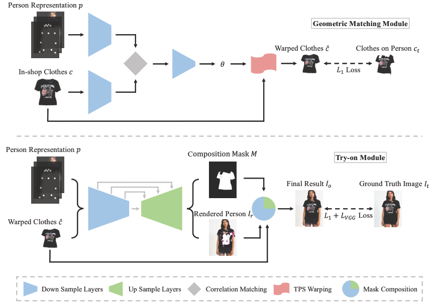

> 中山大学发表在ECCV2018的文章，提出一个 Geometric Matching Module (GMM) 来将服装扭曲到适合人的身体的形状，同时提出一个 Try-On Module 来将扭曲后的服装合成到人物图像上。

 [[paper](http://openaccess.thecvf.com/content_ECCV_2018/papers/Bochao_Wang_Toward_Characteristic-Preserving_Image-based_ECCV_2018_paper.pdf)] [[code_pytorch](https://github.com/sergeywong/cp-vton)] 

---

**重要信息：**

- Resolution: 256 * 192
- Person Representation: 18 pose heatmap + 1 body shape + 3 reserved regions
  - Pose heatmap: an 18-channel feature map with each channel corresponding to one human pose keypoint, drawn as an 11 × 11 white rectangle.
  - Body shape: a 1-channel feature map of a blurred binary mask that roughly covering different parts of human body.
  - Reserved regions: an RGB image that contains the reserved regions to maintain the identity of a person, including face and hair.

---

## Model

### Geometric Matching  Module

先了解一下以前的方法是怎么做的， 主要参考 [Convolutional neural network architecture for
geometric matching](https://arxiv.org/pdf/1703.05593.pdf)。

三个步骤（原文中的描述更加抽象）：

- 分别提取两个输入图像的特征（预训练VGG）
- 匹配特征，得到对应关系
- 再次提取、匹配，得到最后的转换参数，根据这个转换参数将原图像进行扭曲以匹配目标图像

本文的不同点在于：

- 重新训练特征提取器，不使用预训练的 vgg 网络来提取特征 （目标是啥）
- 整个模型的训练的 groundtruth 来源于人物图像（原有的方法任意定义一组参数，根据这组参数使用传统的方法转换图像作为 groundtruth） (什么是传统的方法，如果传统方法做得好的话为什么要用这个模型)
- pixel-wise L1 loss (原有的方法是使用转换参数计算 loss)

### Try-on Module

基于 Unet 的模型结构，输出有两个： Composition Mask $M$, Rendered Person $I_r$. 最后整合为一个。（怎么整合的？看代码）

三个 Loss:

- 整合结果的 loss， 与两个输出都有关
  $$
  I_{o}=M \odot \hat{c}+(1-M) \odot I_{r}
  $$
  where $\odot$ represents element-wise matrix multiplication.

- VGG perceptual loss
  $$
  \mathcal{L}_{\mathrm{VGG}}\left(I_{o}, I_{t}\right)=\sum_{i=1}^{5} \lambda_{i}\left\|\phi_{i}\left(I_{o}\right)-\phi_{i}\left(I_{t}\right)\right\|_{1}
  $$

- L1 regularization

Over Loss:
$$
\mathcal{L}_{\mathrm{TOM}}=\lambda_{L 1}\left\|I_{o}-I_{t}\right\|_{1}+\lambda_{v g g} \mathcal{L}_{\mathrm{VGG}}(\hat{I}, I)+\lambda_{m a s k}\|1-M\|_{1}
$$

## Experiments

### Dataset

来源于 [Viton]( http://openaccess.thecvf.com/content_cvpr_2018/papers/Han_VITON_An_Image-Based_CVPR_2018_paper.pdf ) 的数据集。 

It contains around 19,000 front-view woman and top clothing image pairs. There are 16,253 cleaned pairs, which are split into a training set and a validation set with 14,221 and 2,032 pairs, respectively.

### 评价指标

文章中表述了 IS 不适合做这里的评价指标。

- total variation (TV) norm: 只用于服装, used to make the visual data more local smooth.（如何计算？为什么可以让图像more local smooth? ）
- Amazon Mechanical Turk (AMT) platform

For more, see the text.