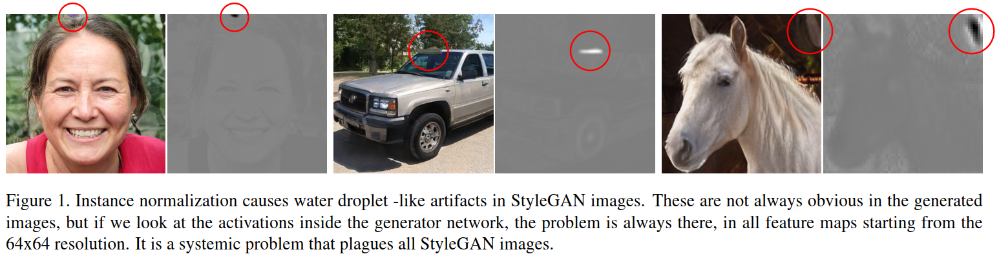
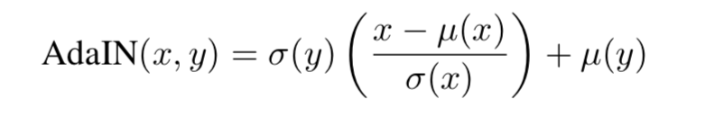

> 基于 StyleGAN 做的改进，生成更高质量的图像。


这篇文章主要内容：

- Redesign generator normalization， 以改进生成图像中常见的局部噪音问题（本文标记为 water droplet -like artifacts）
- 


## Removing normalization artifacts



如图中的圆圈中部分，StyleGAN 生成的图像多有这种问题，虽然大部分情况下这样的块状噪音在视觉难以识别，但它确实存在，在特征图中也可以很明显的观察到，这会有两个问题，一： 判别器检测到这一现象，网络无法继续优化， 二：评估时由于局部噪音引起巨大差距（MSE error）

文中说问题出现的主要原因是 [AdaIN]( https://arxiv.org/pdf/1703.06868.pdf )， 先简单介绍一下 AdaIN：

AdaIN ( Adaptive Instance Normalization) 是2017年提出的用于图像风格转换的归一化方法，基于一个假设：  给定任意的仿射参数能够合成具有任意风格的图像。 

公式如下： 

  

代码如下：**[pytorch-AdaIN](https://github.com/naoto0804/pytorch-AdaIN)**

```python
import torch

def calc_mean_std(feat, eps=1e-5):
    # eps is a small value added to the variance to avoid divide-by-zero.
    size = feat.size()
    assert (len(size) == 4)
    N, C = size[:2]
    feat_var = feat.view(N, C, -1).var(dim=2) + eps
    feat_std = feat_var.sqrt().view(N, C, 1, 1)
    feat_mean = feat.view(N, C, -1).mean(dim=2).view(N, C, 1, 1)
    return feat_mean, feat_std

def adaptive_instance_normalization(content_feat, style_feat):
    assert (content_feat.size()[:2] == style_feat.size()[:2])
    size = content_feat.size()
    style_mean, style_std = calc_mean_std(style_feat)
    content_mean, content_std = calc_mean_std(content_feat)

    normalized_feat = (content_feat - content_mean.expand(
        size)) / content_std.expand(size)
    return normalized_feat * style_std.expand(size) + style_mean.expand(size)
```


> 其实这样的问题不仅仅存在于 StyleGAN 中，之前我生成图像的时候也遇到过，但我并没有使用 AdaIN, 所以可能本文的方法缺乏一般性。